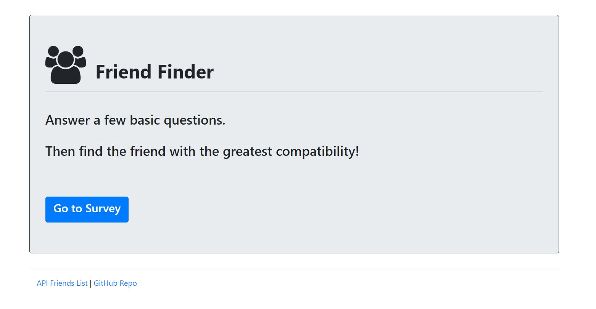
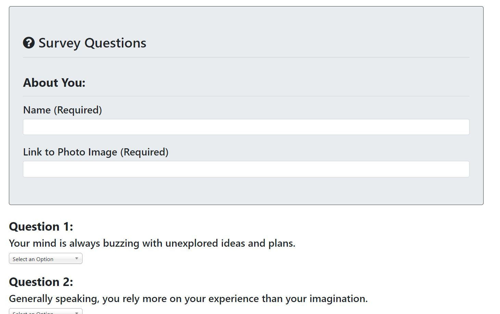

# Friend Finder - Node and Express Servers

- - -
- - -
### Overview:

This App is a compatibility-based "FriendFinder" application -- basically a dating app. This full-stack site will take in results from a 10 question user survey, then compare their answers with those from other users. The app will then display the name and picture of the user with the best overall match.

## Deployed on Heroku <a href="https://afternoon-dawn-41677.herokuapp.com/" rel="nofollow"> here.</a>

- - -
- - -
## Home Page:
- First page of App, allows you to begin the Survey.

- - -
- - -
## Survey Page:
- Enter Name, Upload picture and Answer 10 Survey Questions to be Matched with a New Friend.

- - -
- - -
## Best Match Page:
- Final Page of App, Displays Best Match.

- - -
- - -

- - -
